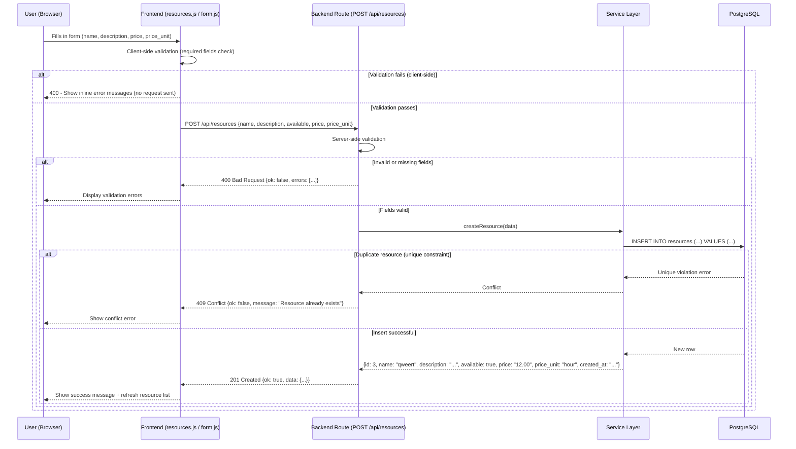
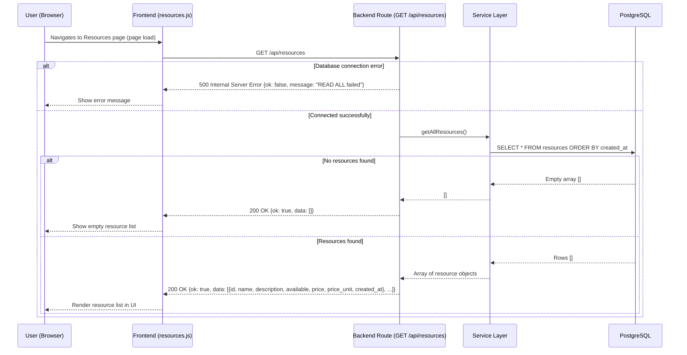
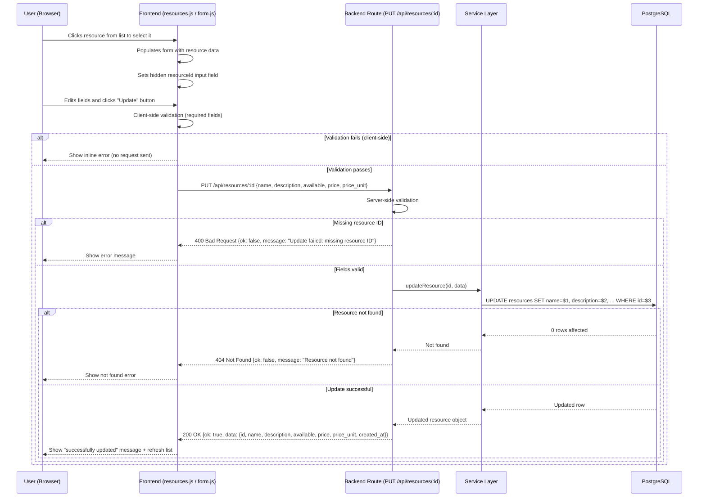

# G1 – CRUD Data Flow: Booking System (Phase 6)

> Each diagram models the actual data flow observed in the Phase 6 Booking System.
> Verified via: Browser DevTools (Network + Console) and VS Code source code search.
> App running at: `http://localhost:5002`

---

## C – CREATE a Resource

> Endpoint: `POST /api/resources`
> Observed response: `{"ok": true, "data": {"id": 3, "name": "qweert", ...}}`



---

## R – READ Resources

> Endpoint: `GET /api/resources`
> Observed response: `{"ok": true, "data": [{id, name, description, available, price, price_unit, created_at}]}`



---

## U – UPDATE a Resource

> Endpoint: `PUT /api/resources/:id`
> Confirmed via source code: `method = "PUT"` in `form.js`



---

## D – DELETE a Resource

> Endpoint: `DELETE /api/resources/:id`
> Observed: `DELETE http://localhost:5002/api/resources/2` → `204 No Content`

```mermaid
sequenceDiagram
    participant U as User (Browser)
    participant F as Frontend (resources.js / form.js)
    participant B as Backend Route (DELETE /api/resources/:id)
    participant S as Service Layer
    participant DB as PostgreSQL

    U->>F: Clicks resource from list to select it
    F->>F: Populates form + sets hidden resourceId input
    U->>F: Clicks "Delete" button

    alt No resource selected (missing ID)
        F-->>U: Show error "Select a resource first" (no request sent)
    else Resource selected
        F->>B: DELETE /api/resources/:id

        B->>S: deleteResource(id)
        S->>DB: DELETE FROM resources WHERE id = $1

        alt Resource not found
            DB-->>S: 0 rows affected
            S-->>B: Not found
            B-->>F: 404 Not Found {ok: false, message: "Resource not found"}
            F-->>U: Show not found error
        alt Resource has active bookings (FK constraint)
            DB-->>S: Foreign key violation
            S-->>B: Conflict
            B-->>F: 409 Conflict {ok: false, message: "Cannot delete: resource has active bookings"}
            F-->>U: Show conflict warning
        else Delete successful
            DB-->>S: Row deleted
            S-->>B: Success
            B-->>F: 204 No Content (empty body)
            F-->>U: Remove resource from list + clear form
        end
    end
```

---

## Summary Table

| Operation | Method   | Endpoint                  | Success Code   | Observed / Confirmed       |
|-----------|----------|---------------------------|----------------|----------------------------|
| Create    | POST     | `/api/resources`          | 201 Created    | ✅ DevTools Network         |
| Read All  | GET      | `/api/resources`          | 200 OK         | ✅ DevTools Network         |
| Update    | PUT      | `/api/resources/:id`      | 200 OK         | ✅ Source code (form.js)    |
| Delete    | DELETE   | `/api/resources/:id`      | 204 No Content | ✅ DevTools Network         |

---

## Key Observations

- The app runs on `http://localhost:5002` (mapped from internal port 5000)
- Frontend files involved: `resources.js` and `form.js`
- Response format is consistent: `{"ok": true, "data": {...}}` for success
- The Update button is only enabled after selecting a resource from the list
- Delete returns **204 No Content** with an empty response body
- Failed validations return requests named **"invalid"** in DevTools (400 status)
- PGHOST must be set to `database` (Docker service name) not `localhost`
